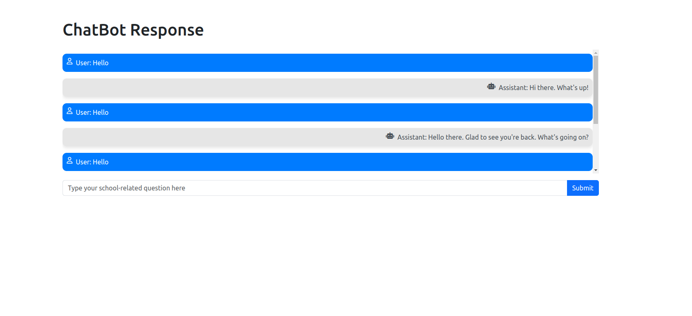

## ChatBot

Welcome to the School ChatBot, a cutting-edge conversational agent powered by FastAPI and LSTM. This intelligent chatbot is designed to assist you with any school-related inquiries, providing quick and accurate responses to your questions.

Key Features:

- Seamless Interaction: Engage in natural and intuitive conversations with the chatbot. Simply type your school-related question, and the chatbot will respond promptly.

- Advanced Natural Language Processing (NLP): The chatbot leverages LSTM, a powerful deep learning model for natural language understanding. This enables the chatbot to grasp the context of your queries and provide contextually relevant answers.

- Extensive Knowledge Base: Backed by a comprehensive dataset of school-related intents, the chatbot is well-equipped to handle a wide range of topics. Whether you have questions about classes, schedules, or general school information, the chatbot has you covered.

- Dynamic Responses: The chatbot's responses are not static but dynamically generated based on the input. This ensures that the information provided is up-to-date and contextually appropriate.

- User-Friendly Interface: Interact with the chatbot through a user-friendly interface, making it accessible to users with varying levels of technical expertise. The chat history is displayed, allowing you to track the conversation effortlessly.

- FastAPI Framework: The backend of the chatbot is powered by FastAPI, a modern, fast, and web framework for building APIs with Python. FastAPI ensures efficient communication between the frontend and the LSTM model.

## Demo

